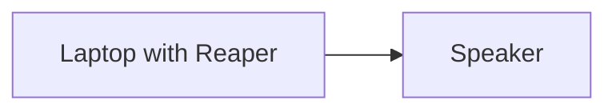
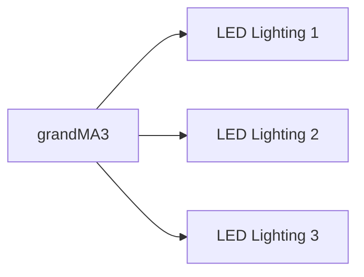

# EGL315

<<<<<<< HEAD
## Lighting Diagram 
=======

## StoryLine


## Control Systems 
>>>>>>> 552f139a11d6703b450cf7c1fc1361590c9e3465

```mermaid
graph LR

<<<<<<< HEAD

=======
A[Laptop] --> B[Rasberry Pi] --> C[Pi Camera] 

```
## Audio System Diagram

## Floor Plan


## Lighting Diagram

