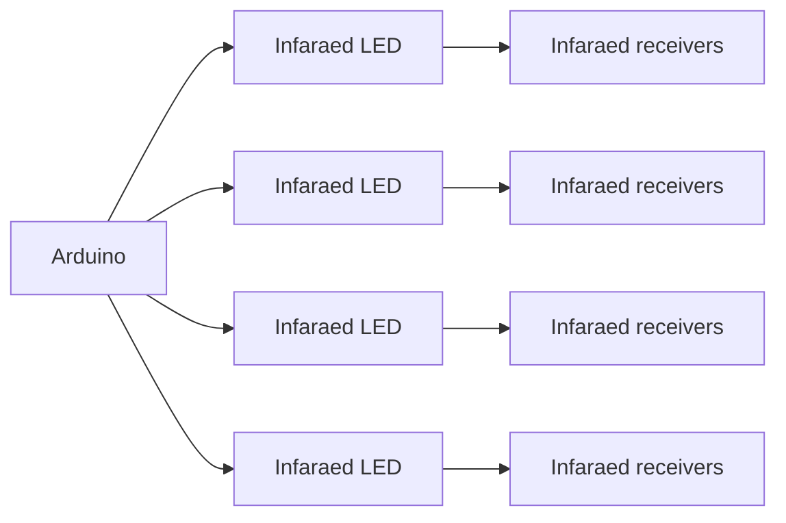
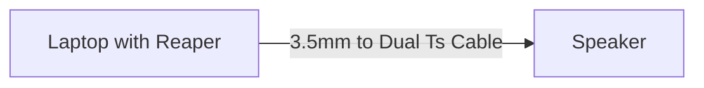
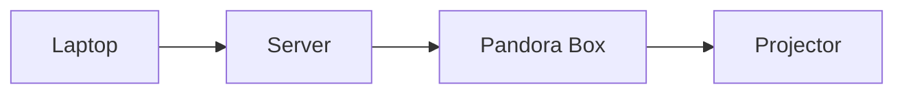
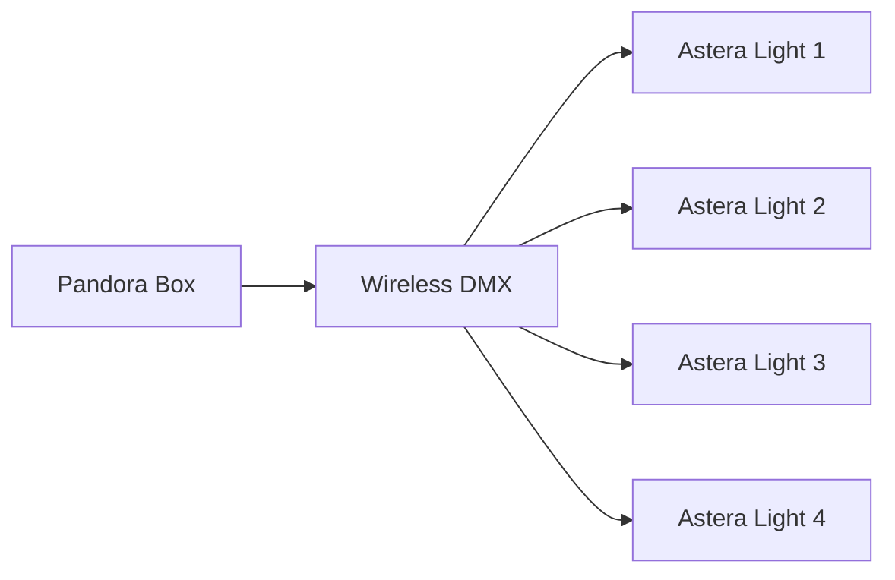
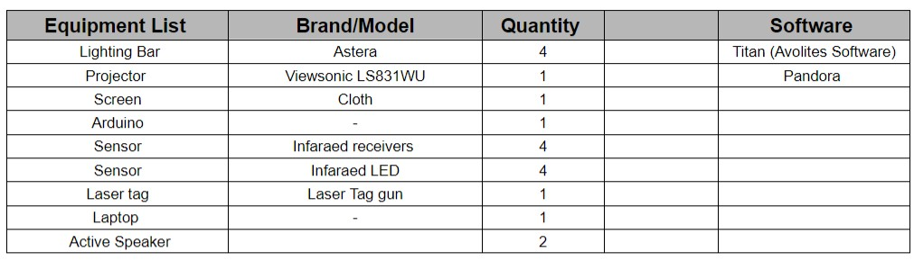

# EGL315 TEAM D
# Storyboard

# System Diagrams
 ## Control Diagram

```mermaid
graph LR

B[Arduino] --> C[Infaraed LED] --> D[Infaraed receivers]
B --> F[Infaraed LED] --> G[Infaraed receivers]
B --> E[Infaraed LED] --> H[Infaraed receivers]
B --> I[Infaraed LED] --> J[Infaraed receivers]
```

## Audio Diagram

```mermaid
graph LR
A[Laptop with Reaper] -->|3.5mm to Dual Ts Cable| B[Speaker]
```

## Video Diagram

```mermaid
graph LR
A[Laptop] --> B[Server] --> C[Pandora Box] --> D[Projector]
```

## Lighting Diagram

```mermaid
graph LR

A[Pandora Box] --> B[Wireless DMX]
B --> C[Astera Light 1]
B --> D[Astera Light 2]
B --> E[Astera Light 3]
B --> F[Astera Light 4]
```
# Equipment List

# Floor Plan

