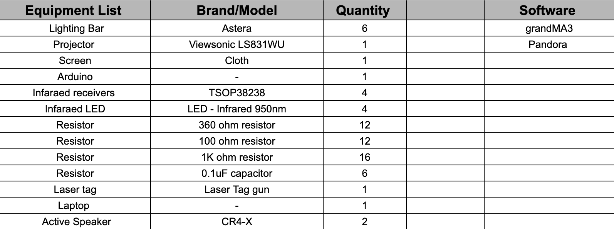
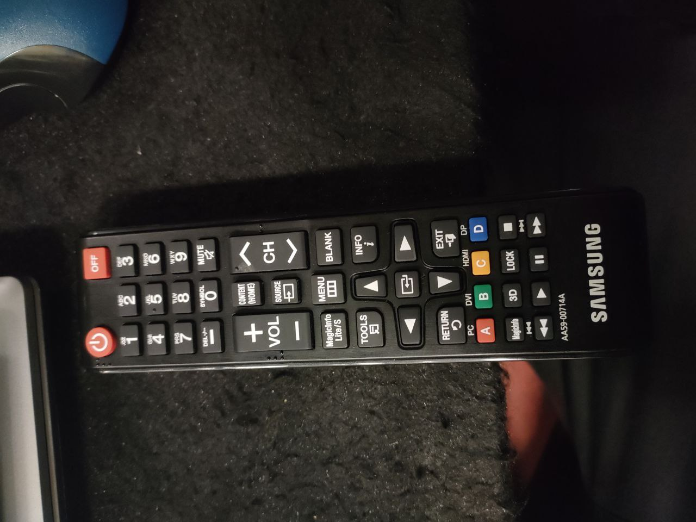

# EGL315 TEAM D
# Storyboard

# System Diagrams
 ## Control Diagram

## Audio Diagram

## Video Diagram

## Lighting Diagram

# Equipment List

# Floor Plan

# Lay0ut And Setup

## Connection & Remote

## Screen Set-Up

## IR Sensor Placement

Each IR Sensor respond to only 1 button . Power , 1 , 2,4 & 5.  

## Audio Setup

Finish soldering of 3.5mm cable which will be connected to the amplifier.

Amplifier setup at the back of the screen and connected to the 2 passive speakers.
