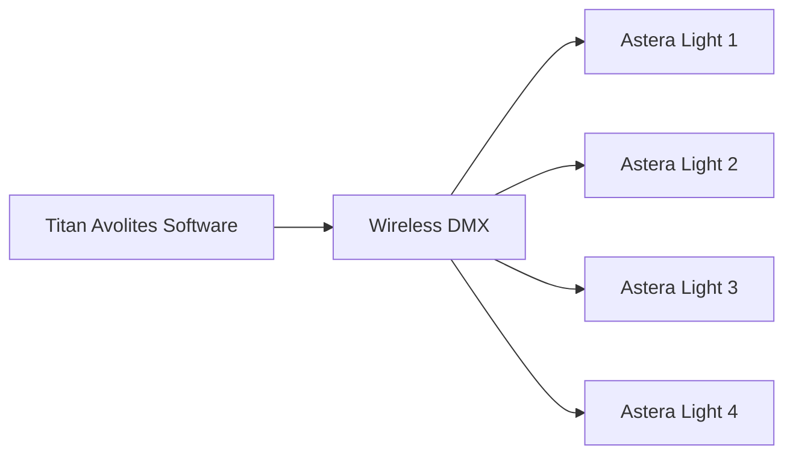

# EGL315 TEAM D
# Storyboard

# System Diagrams
 ## Control Diagram

## Audio Diagram

## Video Diagram

## Lighting Diagram

```mermaid
graph LR

A[Titan Avolites Software] --> B[Wireless DMX]
B --> C[Astera Light 1]
B --> D[Astera Light 2]
B --> E[Astera Light 3]
B --> F[Astera Light 4]
```
# Equipment List

# Floor Plan

