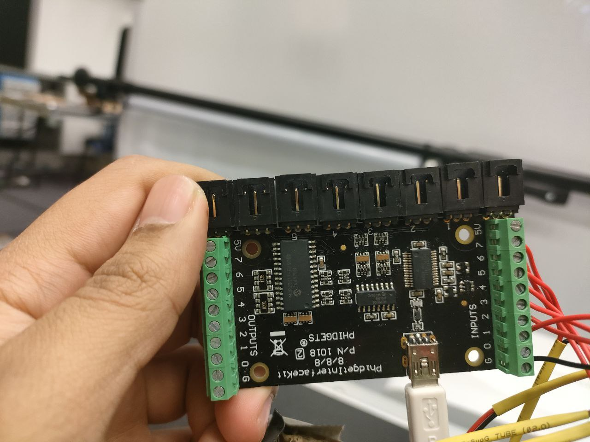

# EGL315 TEAM D (ZOMBIE APOCALYPSE)


# Introdution to our project
Welcome to Zombieverse! (UPDATE!!!!)

# Storyboard


# System Diagrams
 ## Control Diagram


## Audio Diagram


## Video Diagram


## Lighting Diagram


# Equipment List
(UPDATE!!!!!)

# Floor Plan and Layout 
(UPDATE!!!!!)

# Projection Screen SetUp
 

# Button Placement


# Audio Setup

3.5mm cable which will be connected to the amplifier.


Amplifier setup at the back of the screen and connected to the 2 passive speakers.

# Lighting Setup


# Final Setup


# Control Programming



# Lighting Codes

This is the OSC code to control the tube lights from grandMA3.

# Code for each buttons
## Rest Button
```
ScriptTimer1.Stop
ScriptTimer1.Interval=2000
ScriptTimer2.Stop
ScriptTimer2.Interval=1000
ScriptTimer3.Stop
ScriptTimer3.Interval=1000

devicesetmedia(2,11,1,1)
devicesetmedia(2,12,1,2)
devicesetmedia(2,13,1,3)
devicesetmedia(2,14,1,4)
devicesetmedia(2,15,1,5)
devicesetmedia(2,16,1,6)
devicesetmedia(2,17,1,7)
devicesetmedia(2,21,1,1)
devicesetmedia(2,22,1,2)
devicesetmedia(2,23,1,3)
devicesetmedia(2,24,1,4)
devicesetmedia(2,25,1,5)
devicesetmedia(2,26,1,6)
devicesetmedia(2,27,1,7)
devicesetmedia(2,31,1,1)
devicesetmedia(2,32,1,2)
devicesetmedia(2,33,1,3)
devicesetmedia(2,34,1,4)
devicesetmedia(2,35,1,5)
devicesetmedia(2,36,1,6)
devicesetmedia(2,37,1,7)
devicesetmedia(2,41,1,1)
devicesetmedia(2,42,1,2)
devicesetmedia(2,43,1,3)
devicesetmedia(2,44,1,4)
devicesetmedia(2,45,1,5)
devicesetmedia(2,46,1,6)
devicesetmedia(2,47,1,7)
devicesetmedia(2,51,1,1)
devicesetmedia(2,52,1,2)
devicesetmedia(2,53,1,3)
devicesetmedia(2,54,1,4)
devicesetmedia(2,55,1,5)
devicesetmedia(2,56,1,6)
devicesetmedia(2,57,1,7)
devicesetmedia(2,61,2,6)
devicesetmedia(2,62,2,6)
devicesetmedia(2,63,2,6)
devicesetmedia(2,64,2,6)
devicesetmedia(2,65,2,6)
devicesetmedia(2,71,2,10)
devicesetmedia(2,72,2,10)
devicesetmedia(2,73,2,10)
devicesetmedia(2,74,2,10)
devicesetmedia(2,75,2,10)

For i = 11 to 75 {
 DeviceSetParam(2,i,"Opacity",0)
}
//TopLeft
For d = 11 to 17 {
 DeviceSetParam(2,d,"X Pos",-1.98)
 DeviceSetParam(2,d,"Y Pos",-1.275)  
}
//BotLeft
For c = 21 to 27 {
 DeviceSetParam(2,c,"X Pos",-1.91)
 DeviceSetParam(2,c,"Y Pos",1.33)  
}
//TopRight
For a = 41 to 47 {
 DeviceSetParam(2,a,"X Pos",2.69)
 DeviceSetParam(2,a,"Y Pos",-1.15)  
}
//BotRight
For b = 51 to 57 {
 DeviceSetParam(2,b,"X Pos",2.3)
 DeviceSetParam(2,b,"Y Pos",1.69)  
}
DeviceSetParam(2,61,"X Pos",-1.98)
DeviceSetParam(2,61,"Y Pos",-1.275)
DeviceSetParam(2,62,"X Pos",-1.91)
DeviceSetParam(2,62,"Y Pos",1.33)
DeviceSetParam(2,64,"X Pos",2.69)
DeviceSetParam(2,64,"Y Pos",-1.15) 
DeviceSetParam(2,65,"X Pos",2.3)
DeviceSetParam(2,65,"Y Pos",1.69)

SeqGotoCue(1,1)
life = 3
Score = 0
timerCount = 0
start = 0
```

## Start Button
```
posFromRPi=3

if start = 0{
 ScriptTimer1.Stop
 ScriptTimer1.Interval=2000
 ScriptTimer2.Stop
 ScriptTimer2.Interval=1000
 ScriptTimer3.Stop
 ScriptTimer3.Interval=1000
 
 devicesetmedia(2,11,1,1)
 devicesetmedia(2,12,1,2)
 devicesetmedia(2,13,1,3)
 devicesetmedia(2,14,1,4)
 devicesetmedia(2,15,1,5)
 devicesetmedia(2,16,1,6)
 devicesetmedia(2,17,1,7)
 devicesetmedia(2,21,1,1)
 devicesetmedia(2,22,1,2)
 devicesetmedia(2,23,1,3)
 devicesetmedia(2,24,1,4)
 devicesetmedia(2,25,1,5)
 devicesetmedia(2,26,1,6)
 devicesetmedia(2,27,1,7)
 devicesetmedia(2,31,1,1)
 devicesetmedia(2,32,1,2)
 devicesetmedia(2,33,1,3)
 devicesetmedia(2,34,1,4)
 devicesetmedia(2,35,1,5)
 devicesetmedia(2,36,1,6)
 devicesetmedia(2,37,1,7)
 devicesetmedia(2,41,1,1)
 devicesetmedia(2,42,1,2)
 devicesetmedia(2,43,1,3)
 devicesetmedia(2,44,1,4)
 devicesetmedia(2,45,1,5)
 devicesetmedia(2,46,1,6)
 devicesetmedia(2,47,1,7)
 devicesetmedia(2,51,1,1)
 devicesetmedia(2,52,1,2)
 devicesetmedia(2,53,1,3)
 devicesetmedia(2,54,1,4)
 devicesetmedia(2,55,1,5)
 devicesetmedia(2,56,1,6)
 devicesetmedia(2,57,1,7)
 devicesetmedia(2,61,2,6)
 devicesetmedia(2,62,2,6)
 devicesetmedia(2,63,2,6)
 devicesetmedia(2,64,2,6)
 devicesetmedia(2,65,2,6)
 devicesetmedia(2,71,2,10)
 devicesetmedia(2,72,2,10)
 devicesetmedia(2,73,2,10)
 devicesetmedia(2,74,2,10)
 devicesetmedia(2,75,2,10)
 
 For i = 11 to 75 {
  DeviceSetParam(2,i,"Opacity",0)
 }
 
 
 SeqGotoCue(1,1)
 SeqSetState(1,"Play")
 life = 3
 Score = 0
 timerCount = 0
 start = 1
}

elseif randomPos = posFromRPi and start = 1{
 if sheildstatus = 1 {
  PlaySound("C:\Christie\Background music and sound effects\Explosion Sound.wav")
  PlaySound("C:\Christie\Background music and sound effects\Shoot Sound.wav")
  DeviceSetParam(2,sheildPos,"Opacity",0)
  sheildstatus = 0
  OSC_UDP1.Send("OSC_Table1","Alias",["Go+ Sequence 23 Cue 1"])
  WDWait(1)
  OSC_UDP1.Send("OSC_Table1","Alias",["Go+ Sequence 23 Cue 2"])
 }
 else{
  PlaySound("C:\Christie\Background music and sound effects\Explosion Sound.wav")
  PlaySound("C:\Christie\Background music and sound effects\Shoot Sound.wav")
  DeviceSetParam(2,tempNo,"Opacity",0)
  DeviceSetParam(2,73,"Opacity",255)
  PlaySound("C:\Christie\Background music and sound effects\Explosion Sound.wav")
  Score+=1
  OSC_UDP1.Send("OSC_Table1","Alias",["Go+ Sequence 23 Cue 1"])
  WDWait(1)
  OSC_UDP1.Send("OSC_Table1","Alias",["Go+ Sequence 23 Cue 2"])

 }

}
else{
 life = life -1
}
```

## Shooting buttons
```
//data come in from rasp pi
// 1,2,3,4,5
posFromRPi=2

if randomPos = posFromRPi {
 if sheildstatus = 1 {
  //PlaySound("C:\Christie\Background music and sound effects\Explosion Sound.wav")
  //PlaySound("C:\Christie\Background music and sound effects\Shoot Sound.wav")
  DeviceSetParam(2,sheildPos,"Opacity",0)
  sheildstatus = 0
  OSC_UDP1.Send("OSC_Table1","Alias",["Go+ Sequence 23 Cue 1"])
  WDWait(1)
  OSC_UDP1.Send("OSC_Table1","Alias",["Go+ Sequence 23 Cue 2"])
 }
 else{
  //PlaySound("C:\Christie\Background music and sound effects\Explosion Sound.wav")
  //PlaySound("C:\Christie\Background music and sound effects\Shoot Sound.wav")
  DeviceSetParam(2,tempNo,"Opacity",0)
  DeviceSetParam(2,71,"Opacity",255)
  PlaySound("C:\Christie\Background music and sound effects\Explosion Sound.wav")
  Score+=1
  OSC_UDP1.Send("OSC_Table1","Alias",["Go+ Sequence 23 Cue 1"])
  WDWait(1)
  OSC_UDP1.Send("OSC_Table1","Alias",["Go+ Sequence 23 Cue 2"])

 }

}
else{
 life = life -1
}


```
